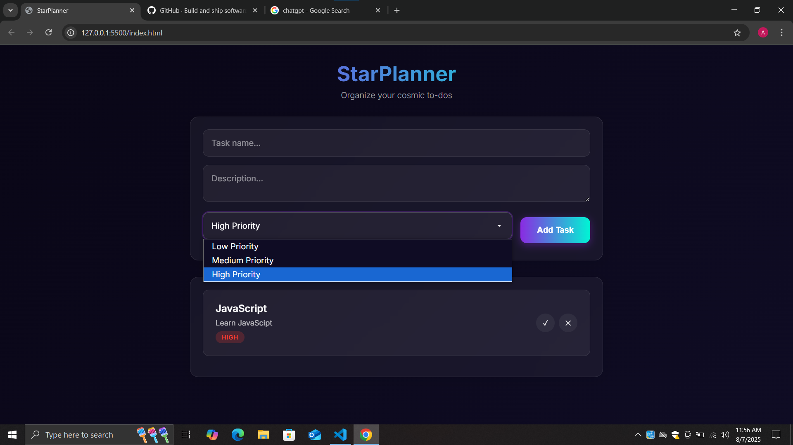

# 🌟 StarPlanner - Task Manager

StarPlanner is a modern, responsive to-do list application designed with a beautiful **glassmorphism UI**. It helps you plan your day, organize tasks with priorities, and stay on top of your goals. Tasks are saved in **localStorage**, so your data is never lost — even when you refresh.

---

## ✨ Features

- 🎯 Add tasks with **title**, **description**, and **priority**
- ✅ Mark tasks as **completed**
- ❌ Delete tasks with a smooth animation
- 💾 Auto-saving with **localStorage**
- 🎨 Clean, aesthetic **glass UI**
- 📱 Fully responsive for mobile & desktop

---

## 🛠️ Tech Stack

- **HTML5**
- **CSS3** (with Glassmorphism & animations)
- **JavaScript (Vanilla)**
- **LocalStorage API**

---

## 📸 Preview

